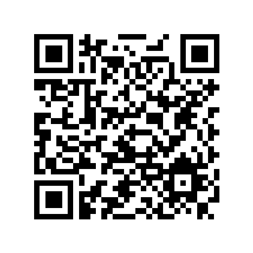

# 显微成像三维重建系统

[](https://www.python.org/downloads/)
[](LICENSE)
[](https://www.microsoft.com/windows)

一个基于焦点堆叠（Focus Stacking）和深度重建技术的显微成像三维重建系统。通过控制 Z 轴扫描和相机自动拍摄，生成深度图、点云数据和全焦合成图像。

---

## 📋 目录

- [功能特性](#-功能特性)
- [技术原理](#-技术原理)
- [输出类型](#-输出类型)
- [系统要求](#-系统要求)
- [安装说明](#-安装说明)
- [使用指南](#-使用指南)
- [项目结构](#-项目结构)
- [依赖库](#-依赖库)
- [常见问题](#-常见问题)
- [许可证](#-许可证)

---

## ✨ 功能特性

### 1. 点云重建
- **原理**：Z 轴逐步停顿，每步拍摄一帧灰度图，通过逐像素锐度分析确定每个像素的最佳焦平面深度值
- **算法**：DFF（Depth From Focus）焦点融合算法
- **输出**：全焦 PNG/TIFF + 16 位深度 TIFF + 彩色点云（PLY/OBJ）
- **入口**：点击菜单栏 **「点云重建(3)...」**，对话框内含保存路径设置

### 2. 连续扫描重建
- **原理**：Z 轴匀速连续扫描，相机按固定时间间隔采集帧，根据时间戳映射 Z 位置
- **高级功能**：支持嵌套精扫融合，提高深度精度
- **输出**：高精度深度图 + 全焦图 + PLY/OBJ 点云 + 输出清单
- **入口**：点击菜单栏 **「连续扫描重建(S)...」**，对话框内含保存路径设置

### 3. 一键出图（快速全焦成像）
- **原理**：Z 轴从高位向低位逐步停拍，自动执行焦点融合
- **特点**：全自动流程，无需手动干预
- **输出**：全焦 PNG/TIFF、16 位深度 TIFF，自动保存并预览
- **高级选项**（可选）：同时生成点云数据，支持可视化和导出 PLY/OBJ/CSV
- **入口**：点击菜单栏 **「一键出图(I)」**，直接弹出对话框

### 4. 可编程拍摄
- **原理**：读取 CSV 时间表，对比本机系统时间触发拍摄
- **CSV 时间格式**：支持 `YYYYMMDDHHmmss`（14 位含秒）或 `YYYYMMDDHHmm`（12 位无秒）两种格式；已过期的时间立即执行，不报错
- **CSV 编码**：支持 GBK（Windows 中文系统默认）
- **参数**：每行独立设置自动对焦、快门 10-1000000 μs、增益 0-10、灯光亮度 0-255，超范围自动按极限值执行
- **灯光时序**：等待期间关灯，到拍摄时间开灯并保持 20 秒
- **输出**：自动保存 BMP 序列，任务结束后合成 24 帧/s MP4 视频
- **入口**：点击菜单栏 **「可编程拍摄(P)」**，直接弹出对话框

### 5. 可视化与导出
- 实时预览拍摄画面
- 支持实时 HDR 增强，一键提升显微图像局部对比度，让弱纹理、裂纹和颗粒边界更清晰
- 支持比例尺叠加显示；全焦 PNG 自动烧录比例尺条，TIFF 保留无标注原始灰度
- 点云 3D 可视化（matplotlib 3D 渲染）
- 深度图显示**等深度轮廓线**并标注数值，颜色条注明「黑紫=高面 / 黄=低面」，一目了然
- 多格式导出：PNG/TIFF（全焦图）、16 位 TIFF（深度图）、PLY/OBJ/CSV（点云/原始数据）

---

## 🔬 技术原理

### DFF（Depth From Focus）算法
通过分析同一场景在不同焦平面的图像锐度分布，逐像素选择最清晰的焦平面，从而反推深度信息。

**核心步骤**：
1. **多层拍摄**：Z 轴移动到不同深度位置，采集多张图像
2. **锐度计算**：使用拉普拉斯算子计算每个像素的锐度值
3. **深度映射**：每个像素选择锐度最大的帧对应的 Z 值作为深度，并使用相邻三层锐度做二次曲线亚步长拟合
4. **焦点融合**：合成全焦图像（所有像素都处于最佳焦点状态）

### 控制与预处理
- **上位机/下位机协同**：PyQt5 主界面负责参数配置与状态显示，扫描、融合和保存运行在工作线程；串口通过 G-code 控制 Z 轴与 PWM 灯光，停拍扫描会等待 `M400` 运动完成后再采集图像。
- **底噪扣除**：遮光后采集 50 帧暗场图像并计算逐像素均值模板，启用后实时从每帧原始图像中扣除，支持 Mono8 / Mono10 / Mono12 / Mono12_Packed。
- **HDR 增强**：在相机预览显示前对每帧做局部对比度增强；优先使用 OpenCV CLAHE，缺少 OpenCV 时自动退回百分位拉伸，支持 Mono、Bayer 和 RGB/BGR 常见像素格式。
- **自动标定与比例尺**：通过移动前后两帧的亚像素相位相关位移计算 `pixels/mm`；快速比例尺会对白底黑点标定板做 blob 检测，随机取 5 个圆点的最近邻平均间距，并按 200 μm 点距换算，右下角显示白色 μm 比例尺。
- **ATLAS Focus 自动对焦**：使用当前曝光/增益参数，通过有效纹理块筛选 + 多尺度 Tenengrad/Laplacian/Brenner 融合评分定位焦点；Z 轴先粗扫峰区，再按 0.030/0.015/0.008/0.004 mm 逐级自适应精扫，最终用二次拟合计算亚步长焦点位置，并在结果变差时回退到实测最佳焦面。

### 点云生成
- 根据深度图和相机参数，将 2D 深度图转换为 3D 点云
- 支持 Z 轴缩放调整，适配不同显微系统
- 可导出为 PLY 格式，兼容 MeshLab、CloudCompare 等点云处理软件

---

## 🖼️ 输出类型

| 输出类型 | 格式 | 说明 |
|---------|------|------|
| **全焦合成图** | PNG（8 位）/ TIFF（8 或 12 位源数据） | PNG 带比例尺条；TIFF 保留无标注高位灰度，可直接用于测量或发表 |
| **深度图** | 16 位灰度 TIFF | 像素值为相对高度，单位 μm，可导入 ImageJ 做剖面分析 |
| **点云数据** | PLY / OBJ / CSV | 三维坐标点集，包含 X, Y, Z、强度和 RGB 纹理颜色 |
| **可编程拍摄序列** | BMP + MP4 | CSV 定时拍摄得到的图片序列，任务结束后自动合成 24fps 视频 |
| **锐度图** | 灰度图像 | 每个像素的锐度分布，用于质量评估 |
| **输出清单** | JSON | 记录时间戳、参数、单位和文件名，便于追溯 |

### 示例输出

```
output/
├── recon_20260321_143022_z0-2_z12_step0p1_full_focus.png
├── recon_20260321_143022_z0-2_z12_step0p1_full_focus.tif
├── recon_20260321_143022_z0-2_z12_step0p1_depth_um16.tif
├── recon_20260321_143022_z0-2_z12_step0p1_point_cloud.ply
├── recon_20260321_143022_z0-2_z12_step0p1_point_cloud.obj
└── recon_20260321_143022_z0-2_z12_step0p1_manifest.json
```

---

## 💻 系统要求

### 硬件要求
- **相机**：支持 MvCamera SDK 的工业相机（海康威视等）
- **运动平台**：Z 轴电动平台，串口通信（可选）
- **操作系统**：Windows 7/10/11
- **内存**：建议 8GB 及以上

### 软件要求
- Python 3.7 或更高版本
- PyQt5（图形界面）
- NumPy（数值计算）
- Matplotlib（3D 可视化）

---

## 📦 安装说明

### 1. 克隆仓库
```bash
git clone https://github.com/daihuohuo2/microscope-3d-reconstruction.git
cd code
```

### 2. 安装依赖
```bash
pip install -r requirements.txt
```

### 3. 安装相机 SDK
根据你的相机型号，安装对应的 SDK 驱动：
- 海康威视工业相机：安装 MVS SDK
- 其他品牌：将 SDK 的 Python 接口放置到 `sdk/` 目录

### 4. 配置串口（可选）
如果需要控制 Z 轴运动平台，安装 pySerial：
```bash
pip install pyserial
```

---

## 🚀 使用指南

### 启动程序
```bash
python main.py
```

### 主界面布局

```
菜单栏：  点云重建(3)...  连续扫描重建(S)...  一键出图(I)  可编程拍摄(P)

左列（固定宽度）：初始化 / 采集 / 参数 / HDR增强 / 比例尺 / 底噪扣除
右列（固定宽度）：串口设置 / 运动控制（占满剩余空间）
中间：相机实时预览画面
```

> **菜单栏四个入口均为直接点击触发**，不含二级子菜单。

### 基本操作流程

#### 方法一：点云重建
1. 枚举设备 → 选择相机 → 打开设备 → 开始取流
2. 连接串口（Z 轴控制必须）
3. 点击菜单栏 **「点云重建(3)...」**
4. 在对话框内设置扫描范围、步长、延时，并设置**保存路径**
5. 点击「开始重建」，完成后可视化/导出点云

#### 方法二：连续扫描重建
1. 枚举设备 → 打开设备 → 开始取流 → 连接串口
2. 点击菜单栏 **「连续扫描重建(S)...」**
3. 设置速度、采帧间隔，可选开启嵌套精扫，设置**保存路径**
4. 点击「开始扫描」

#### 方法三：一键出图（最快）
1. 枚举设备 → 打开设备 → 开始取流 → 连接串口
2. 点击菜单栏 **「一键出图(I)」**
3. 设置 Z 轴范围和步长，设置**保存路径**
4. （可选）勾选「同时生成点云数据」
5. 点击「一键出图」，1-2 分钟完成

#### 方法四：可编程拍摄
1. 准备 CSV 文件（GBK 或 UTF-8 编码均可）
2. 时间列支持 `YYYYMMDDHHmmss`（14 位）或 `YYYYMMDDHHmm`（12 位）
3. 已过期的时间会立即执行，无需设置未来时间
4. 打开设备 → 开始取流 → 连接串口
5. 点击菜单栏 **「可编程拍摄(P)」**
6. 选择 CSV 文件，在对话框内设置**图片保存文件夹**
7. 点击「开始执行」，完成后自动生成 `output_24fps.mp4`

#### HDR 实时增强
1. 枚举设备 → 打开设备 → 开始取流
2. 在左侧 **「HDR增强」** 分组中勾选 **「启用 HDR」**
3. 预览画面会实时增强局部对比度，适合白底低对比样品、裂纹纹理和颗粒边界观察
4. 停止采集或关闭相机时，HDR 会自动关闭

CSV 示例：
```csv
拍照时间,自动对焦,快门us,增益,灯光亮度
20260504143000,1,20000,2,180
20260504143100,0,5000,0,120
```

---

## 📁 项目结构

```
.
├── main.py                    # 程序入口
├── main_window.py             # 主窗口逻辑
├── device_controller.py       # 设备控制（相机 + 串口）
├── algorithms.py              # 核心算法（DFF、点云生成等）
├── config_manager.py          # 配置文件管理
├── overlays.py                # 界面叠加层（比例尺等）
├── setting.ini                # 配置文件
│
├── dialogs/                   # 功能对话框
│   ├── __init__.py
│   ├── recon_dialog.py        # 点云重建对话框
│   ├── temporal_depth_dialog.py   # 时间换位深度对话框
│   ├── one_click_dialog.py    # 一键出图对话框
│   └── programmable_shooting_dialog.py  # 可编程拍摄对话框
│
├── sdk/                       # 相机 SDK 接口
│   ├── CamOperation_class.py
│   ├── MvCameraControl_class.py
│   ├── MvErrorDefine_const.py
│   └── CameraParams_header.py
│
└── ui/                        # UI 界面文件
    └── PyUICBasicDemo.py
```

---

## 📚 依赖库

创建 `requirements.txt` 文件：

```
PyQt5>=5.15.0
numpy>=1.19.0
matplotlib>=3.3.0
pyserial>=3.5
opencv-python>=4.5.0  # 可选，用于图像处理
```

安装命令：
```bash
pip install -r requirements.txt
```

---

## ❓ 常见问题

### Q1: 相机连接失败怎么办？
**A**:
- 检查相机是否正确连接并供电
- 确认已安装相机厂商提供的 SDK
- 尝试重新枚举设备

### Q2: Z 轴不移动怎么办？
**A**:
- 检查串口连接是否正常
- 确认波特率设置正确（默认 19200，可尝试 9600/115200）
- 检查运动平台供电和使能状态

### Q3: 生成的点云质量差怎么办？
**A**:
- 减小 Z 轴步长，提高采样密度
- 调整相机曝光时间，确保图像清晰
- 增加每步延时，确保平台稳定后再拍摄
- 使用"连续扫描重建 + 嵌套精扫"模式

### Q4: 支持哪些相机品牌？
**A**:
当前主要支持海康威视工业相机（MVS SDK）。控制链路采用通用串口 G-code，默认波特率为 19200；其他品牌相机需要适配 `sdk/` 目录下的接口代码。

### Q5: 输出的 .ply 文件如何查看？
**A**:
推荐使用以下软件：
- **MeshLab**（免费开源）
- **CloudCompare**（免费开源）
- **Blender**（免费开源，功能强大）

---

## 🤝 贡献

欢迎提交 Issue 和 Pull Request！

1. Fork 本仓库
2. 创建特性分支 (`git checkout -b feature/AmazingFeature`)
3. 提交更改 (`git commit -m 'Add some AmazingFeature'`)
4. 推送到分支 (`git push origin feature/AmazingFeature`)
5. 开启 Pull Request

---

## 📄 许可证

本项目采用 GNU General Public License v3.0（GPL-3.0）开源协议。详见 [LICENSE](LICENSE) 文件。

扫描下方二维码可访问项目开源仓库：



---

## 📧 联系方式

如有问题或建议，欢迎通过以下方式联系：

- 提交 Issue：[GitHub Issues](https://github.com/daihuohuo2/microscope-3d-reconstruction/issues)
- 邮箱：your.email@example.com

---

## 🙏 致谢

感谢以下开源项目：
- [PyQt5](https://www.riverbankcomputing.com/software/pyqt/) - 图形界面框架
- [NumPy](https://numpy.org/) - 数值计算库
- [Matplotlib](https://matplotlib.org/) - 数据可视化库

---

**⭐ 如果这个项目对你有帮助，请给个 Star！**
